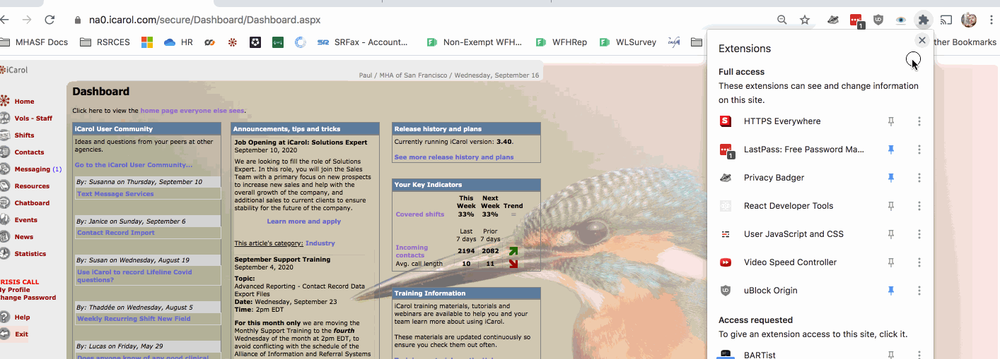
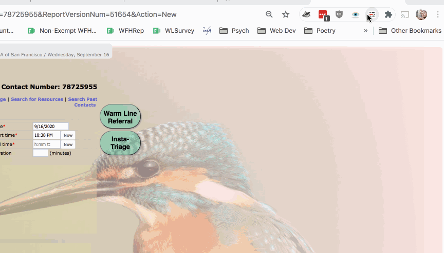

# flyCarol [beta!]
## Tools to make iCarol more usable and enjoyable (specifically for SF-WL)

### Installation
1. Install Chrome (currently only Chrome is working):
https://www.google.com/chrome/
2. Install User JS and CSS Chrome Extension: https://chrome.google.com/webstore/detail/user-javascript-and-css/nbhcbdghjpllgmfilhnhkllmkecfmpld
3. Download the latest JSON file. **Right-click** here -> <a href="https://raw.githubusercontent.com/mooserson/flyCarol/master/current_version/v0.3user-js-css-v8-200917.json" download>v0.3</a> <- and click `Save Link As` and save it as a JSON file (should be the default).

4. Upload the JSON into the User JS and CSS Extention as shown below (open the extension, go to Settings tab and click Upload and Apply and select the JSON file you just downloaded):

 

5. To enable or disable a certain feature click the extension, toggle the feature and refresh the page:

 

6. This is a beta so feel free to ask me for help so I know what is not working, try and break it and let me know how it is! Thanks, email: paul(dot)cathey(at)mentalhealthsf.org
